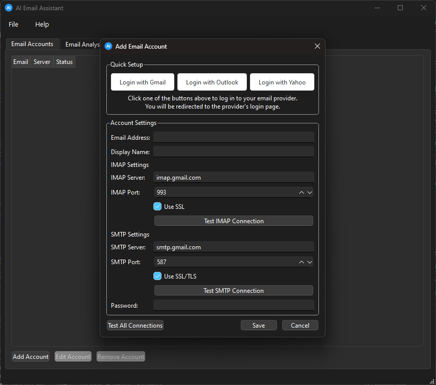

# AI Email Assistant


## Project Overview
The AI Email Assistant is a standalone desktop application built using Python and PyQt. It is designed to manage email accounts, fetch emails, analyze content, and generate AI replies using the Gemini API. Additionally, a Thunderbird extension is developed using JavaScript to integrate the assistant's features directly into the Thunderbird email client.

## Features
- Manage email accounts with IMAP/SMTP settings.
- Fetch and parse emails for analysis.
- Generate intelligent reply suggestions using the Gemini API.
- Seamless integration with Thunderbird to display AI-generated replies.

## Application Screenshots

### Email Account Configuration


The email account configuration interface provides:
- Quick setup options for Gmail, Outlook, and Yahoo
- Manual configuration options for custom email servers
- IMAP and SMTP server settings
- Connection testing capabilities
- SSL/TLS security options

## Setup Instructions

### Prerequisites
- Python 3.x
- PyQt6
- Thunderbird (for extension integration)
- Google Gemini API Key (get it from [Google AI Studio](https://makersuite.google.com/app/apikey))

### Installation
1. Clone the repository:
   ```bash
   git clone <repository-url>
   ```
2. Navigate to the project directory:
   ```bash
   cd ai-email-client
   ```
3. Install the required Python packages:
   ```bash
   pip install -r requirements.txt
   ```
4. Set up environment variables:
   ```bash
   cp .env.template .env
   ```
   Then edit `.env` and add your Gemini API key. Never commit this file to version control!

### Running the Application
1. Start the desktop application:
   ```bash
   python src/main.py
   ```
2. Follow the on-screen instructions to add email accounts and generate AI replies.

## Security Notes
- The `.env` file contains sensitive information and is excluded from version control.
- Never commit your API keys or email credentials to the repository.
- The application stores email credentials securely using system keyring.

## Thunderbird Extension
- The extension allows users to access the AI assistant's features directly within Thunderbird.
- Follow the instructions in the `extension` directory to install and use the extension.

## Contributing
Contributions are welcome! Please fork the repository and submit a pull request for any enhancements or bug fixes.

## License
This project is licensed under the MIT License. See the LICENSE file for more details. 